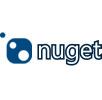
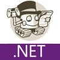

# .NET Client for Telegram Bot API

  

**Telegram.Bot** is the most popular .NET Client for [Telegram Bot API].

The Bot API is an HTTP-based interface created for developers keen on building bots for [Telegram].

Check 👉 [_Bots: An introduction for developers_] 👈 to understand what a Telegram bot is and what it can do.

We, the [Telegram Bots team], mainly focus on developing multiple [NuGet packages] for creating chatbots.

> ➡️ If Bot API is too limited for your use cases you can try Telegram Client API implementation written 100% in C#
> <https://github.com/wiz0u/WTelegramClient>

|Packages|Documentation|News Channel|Team|Group Chat|
|:-----:|:-----------:|:----------:|:--:|:--------:|
|  |  |  |  |  |
| Our nuget package feed | Telegram bots book | Subscribe to 📣 [`@tgbots_dotnet`] channel to get our latest news | The team contributing to this work | [Join our chat] 💬 to talk about bots and ask questions |

## 🔨 Getting Started

Please check ➡️ [the Quickstart guide].

## 🚧 Supported Platforms

Project targets **.NET Standard 2.0** and **.NET 6** at minimum.

## 📦 Extension Packages

This project is referred to as the core package and is always required for developing Telegram bots.
There are extension packages that you can include in your bot projects for additional functionality:

- [Telegram.Bot.Extensions.LoginWidget]
- [Telegram.Bot.Extensions.Passport]

## ✅ Correctness & Testing

This project is fully tested using Unit tests and Systems Integration tests before each release.
In fact, our test cases are self-documenting and serve as examples for Bot API methods.
Once you learn the basics of Telegram chatbots, you will be able to easily understand the code in examples and
use it in your own bot projects.

## 🗂 References

- [Changelog](CHANGELOG.md)
- [Documentation](https://telegrambots.github.io/book/)
- [Examples](https://github.com/TelegramBots/Telegram.Bot.Examples)

<!-- ---- -->

[Telegram Bot API]: https://core.telegram.org/bots/api
[Telegram]: https://www.telegram.org/
[_Bots: An introduction for developers_]: https://core.telegram.org/bots
[Telegram Bots team]: https://github.com/orgs/TelegramBots/people
[NuGet packages]: https://www.nuget.org/profiles/TelegramBots
[`@tgbots_dotnet`]: https://t.me/tgbots_dotnet
[Join our chat]: https://t.me/joinchat/B35YY0QbLfd034CFnvCtCA
[the Quickstart guide]: https://telegrambots.github.io/book/1/quickstart.html
[Telegram.Bot.Extensions.LoginWidget]: https://github.com/TelegramBots/Telegram.Bot.Extensions.LoginWidget
[Telegram.Bot.Extensions.Passport]: https://github.com/TelegramBots/Telegram.Bot.Extensions.Passport
